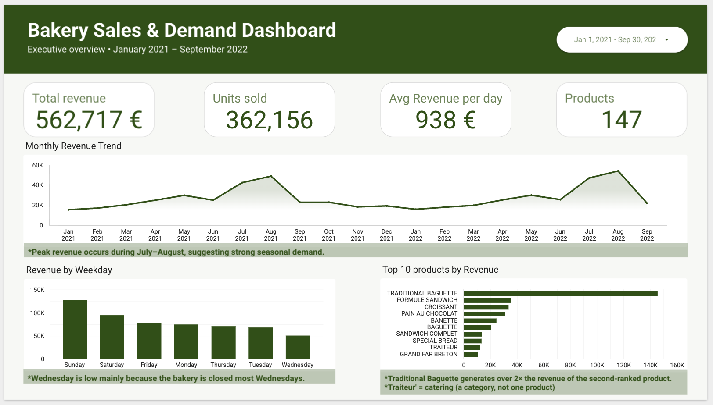

# Yield & Production Waste Optimization
### Bakery Sales, Demand & Production Analytics

**An end-to-end data analytics project turning two years of real bakery sales into production-planning insight, built by a baker moving into data.**

> **Status:** Complete. Two layers — a real POS analysis, and a clearly separated
> synthetic production layer that claims no findings.

🔗 **[Live dashboard →](https://datastudio.google.com/reporting/bde95bb5-686c-4339-b187-8d770afe2693)**



---

## Why I built this

I'm a baker. I trained as a Bäckergeselle and spent about nine years in industrial food production before moving into data analytics, so this isn't a dataset I picked at random. It's the problem I lived with every day.

In a bakery you're always guessing. Make too much and it goes in the bin at closing. Make too little and you turn customers away and lose the sale. This project uses real sales data to take some of that guessing out of production planning, so a bakery can make less waste without losing sales.

---

## Two layers, and only one is real

This is one project with two layers, separated by where the data came from.

**The real layer** is the sales and demand analysis below. It runs on a genuine point-of-sale export, and it's the only part of this repo I draw business conclusions from.

**The synthetic layer** adds production data a till never records — batches, machine downtime, scrap, quality inspections — generated by a seeded script in this repo. It exists to show that I can build a production data model and derive OEE correctly from raw events. It produces **no findings, by construction**: I wrote the data, so any pattern in it is my own assumption reflected back at me. Every fabricated number in it is declared.

Keeping those two apart, and saying which is which, matters more to me than having more charts.

---

## The data

A real point-of-sale export from a French bakery, January 2021 to September 2022. I started with 234,005 raw rows and cleaned it down to **232,679 sales lines across 147 products**, worth **€562,717** in revenue. Cleaning meant converting text prices like `"0,90 €"` into real numbers, merging separate date and time columns into one timestamp, and removing 1,295 returns and 31 zero-price rows (a refund isn't demand, so it doesn't belong in a demand analysis). Every column is documented in [`docs/data_dictionary.md`](docs/data_dictionary.md).

---

## What I found

**One product carries the business.** The traditional baguette is about a third of every item sold and roughly a quarter of all revenue, more than the next four products put together.

**Best sellers aren't best earners.** Sandwiches sell in much smaller numbers but jump near the top on revenue, because they carry a far higher price than a ninety-cent baguette. Planning production off unit counts alone would quietly undervalue them.

**Demand is weekend-heavy.** Sunday is the biggest day by a wide margin, around two and a half times a normal weekday. Wednesday looks like the deadest day, but that's because the bakery is closed most Wednesdays (62 trading days versus about 90 for other days), not because nobody wants bread. Catching that before writing it down mattered.

**There's a repeatable summer peak.** July and August are the strongest months in both 2021 and 2022, and it holds up even when I compare average revenue per open day, so it's a real seasonal signal rather than a counting quirk.

**It's a morning business.** Sales concentrate between 8am and noon, peaking around 11, then drop off sharply in the afternoon.

**So what:** prioritise baguette availability, treat sandwiches as high-value items worth protecting, and scale production up for weekends and summer.

---

## The synthetic production layer

A five-table star schema — `dim_product`, `dim_machine`, `fact_production_batch`, `fact_downtime`, `fact_quality_inspection` — holding 8,770 batches, 16,029 downtime events and 2,166 quality inspections across the same 21 months of real demand.

**The generator writes raw events only.** Planned and actual quantities, run times, good and scrap units, downtime intervals, inspection outcomes. It never writes a yield percentage, a waste rate, or an OEE number. Every KPI derives in SQL, and OEE reconciles from Availability × Performance × Quality — asserted at batch grain *and* after aggregation, because naive rollups break once products have different ideal rates.

Production rates aren't hardcoded either. They derive from six equipment numbers and a bake time per product: a three-deck oven holding 30 baguettes a deck, a rack oven with 18 trays, and the handling allowance for each. Change an input and every affected rate recomputes.

### Where it gets interesting

Real production data is wrong in specific ways, and the generator reproduces two of them on purpose.

Downtime reason codes get miscoded to a catch-all, because "Other" is the fastest button on the terminal. And micro-stops — a tray catches, a door needs reseating — never get logged at all.

The result:

| Reason code | True share of lost time | As reported |
|---|---|---|
| **Changeover** | **77.5%** | 53.1% |
| **Micro-stops** | **15.8%** | **0.0%** |
| **"Other"** | **0.0%** | **40.0%** |

The largest bucket in the plant's own downtime report corresponds to nothing that happened. The second-largest true cause of lost time appears nowhere at all — 168 hours of it, not one minute recorded. A maintenance team prioritising off that Pareto would fix the wrong thing and never learn the biggest thing existed.

It flatters Availability too: the rack oven reads **0.757** off the operator log against an actual **0.534**.

**This is a finding about data quality, not about bread.** It's the argument for validating reason coding before you trust a downtime report — and it's a check an analyst can genuinely run in a real plant, comparing machine counters against the operator log.

### What it does and doesn't prove

It proves I can design an MES-style schema and derive the standard metrics correctly from it. It does **not** prove I can analyse a plant — I wrote the data, so there is nothing to find. Full scope, assumptions and limitations: [`docs/synthetic_layer_scope.md`](docs/synthetic_layer_scope.md) and [`docs/synthetic_layer_assumptions.md`](docs/synthetic_layer_assumptions.md).

Reproducible from a fixed seed, with a 15-assertion validation suite in [`sql/synthetic/09_validate_synthetic_layer.sql`](sql/synthetic/09_validate_synthetic_layer.sql).

---

## How I built it

The full write-up of every step and the reasoning behind it is in [`docs/build_guide.md`](docs/build_guide.md).

- **Cleaning and analysis:** Python (pandas, NumPy) in Jupyter notebooks. See [`notebooks/`](notebooks/).
- **Data modelling:** loaded the clean data into Google BigQuery and built KPI views in SQL. See [`sql/`](sql/).
- **Dashboard:** Google Data Studio, served from an aggregated Google Sheet rather than a live BigQuery connection — cheaper to run and it survives a billing lapse, which matters for a public portfolio link.
- **Charts:** Matplotlib. See [`images/charts/`](images/charts/).

---

## Repository structure

```
├── data/            raw + cleaned data
├── notebooks/       01 understanding → 03 exploratory analysis
├── config/          generator configuration — every fabricated number in one file
├── sql/             BigQuery views and KPI queries
│   └── synthetic/   synthetic production layer: schema, KPI views, validation
├── dashboard/       dashboard screenshots + SQL proof
├── images/charts/   analysis charts
├── docs/            project scope, hypotheses, data dictionary, build guide
└── scripts/         dashboard data aggregation
```

---

## Reproduce it

```bash
git clone https://github.com/laureanojr/yield-product-waste-optimization.git
cd yield-product-waste-optimization
python -m venv .venv && source .venv/bin/activate
pip install -r requirements.txt
gcloud auth application-default login
```

**Real layer:** run the notebooks in order, 01 → 03.

**Synthetic layer** (set the BigQuery query location to EU first):

```bash
# 1. dimensions      sql/synthetic/05_create_dim_machine.sql
#                    sql/synthetic/06_author_product_standards.sql
# 2. empty facts     sql/synthetic/07_create_fact_tables.sql

python scripts/generate_synthetic_production.py
python scripts/load_synthetic_to_bigquery.py

# 3. KPI views       sql/synthetic/08_create_kpi_views.sql
# 4. validate        sql/synthetic/09_validate_synthetic_layer.sql
```

---

## About me

Journeyman baker moving into data analytics, based in the Hamburg area. I combine nine years in industrial food manufacturing with a B.Sc. in Business Administration and a data analytics bootcamp, and I use the production floor as the lens for my analytics work.

📫 [LinkedIn](https://www.linkedin.com/in/laureanojr-cantor) · [Email](mailto:laureano@jrcantor.de)
